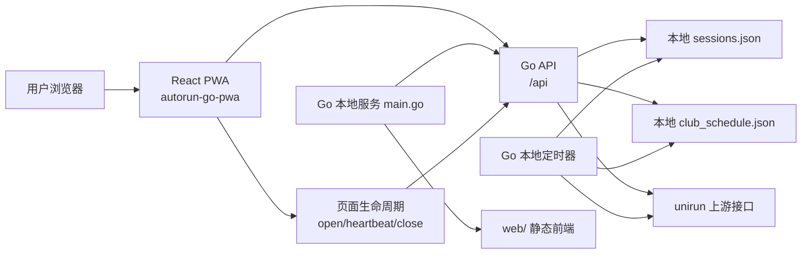
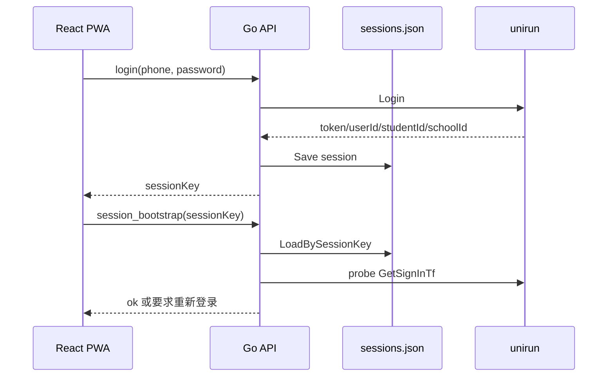
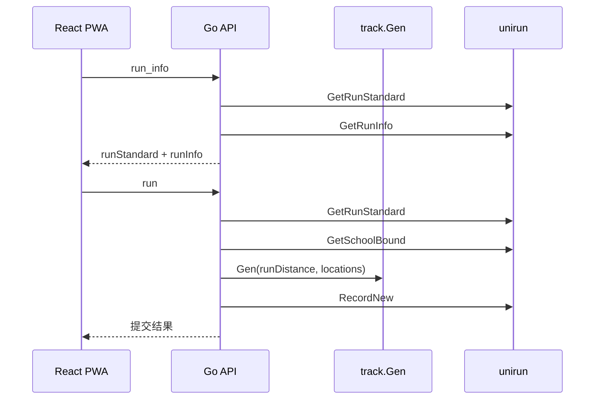
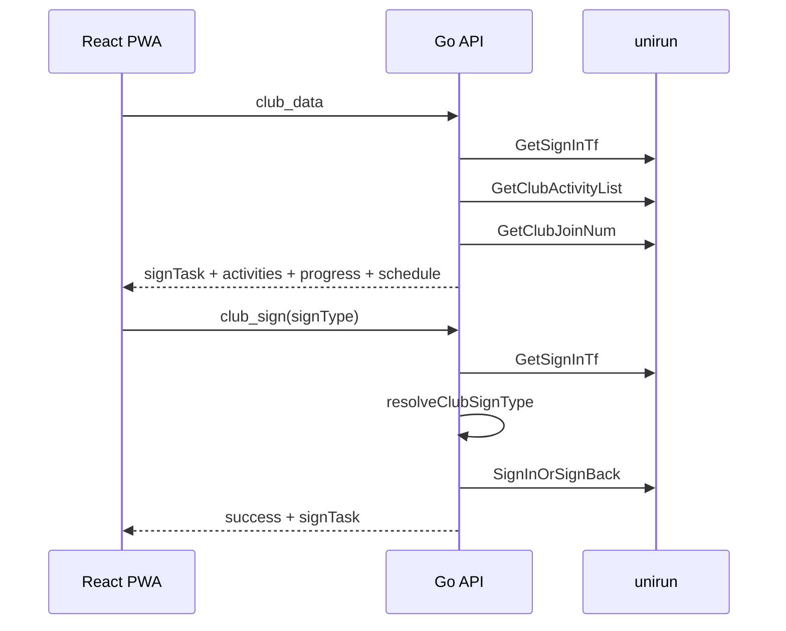
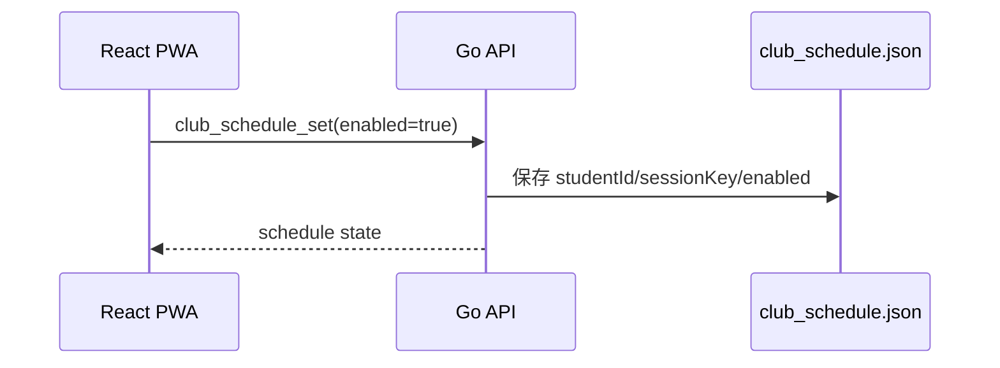
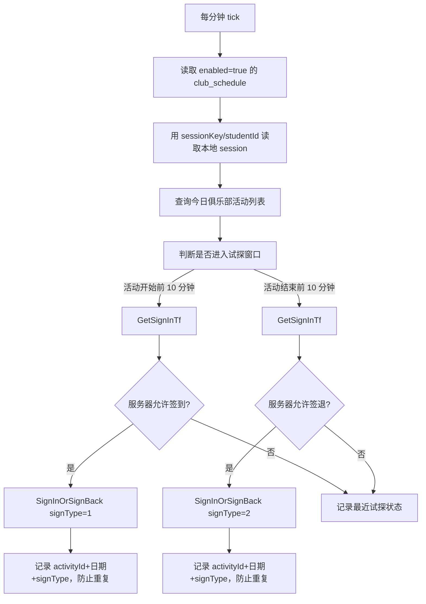
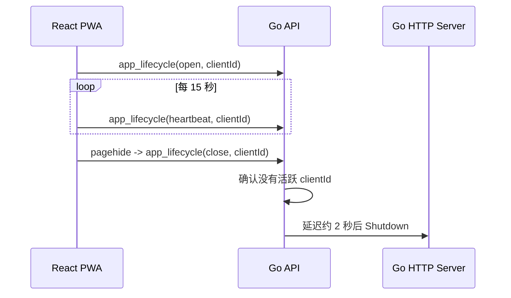

# AutoRun 本地版架构文档

## 1. 目标与边界

AutoRun 本地版的目标是把原来的 Go API 和 React 前端封装成一个可以在用户电脑上直接启动的本地应用。

本次平台化适配遵守两个边界：

- 不改变原来的登录、签名、轨迹生成、跑步提交、俱乐部签到/签退判断等业务算法。
- 只增加本地启动、前端托管、本地存储、本地定时调度和小白用户可用的打包方式。

整体形态是：

```text
用户浏览器 -> React PWA -> 本机 Go HTTP 服务 -> unirun 上游接口
                          -> 本地 JSON 存储
                          -> 本地定时调度器
```

## 2. 总体架构



本地发行包里只有一个 Go 可执行文件、一个 `web/` 前端目录和启动脚本。Go 程序启动后同时承担两个职责：

- 托管 React 构建产物。
- 提供 `/api` 后端接口。

这样用户不需要安装 Node、pnpm、数据库、Redis 或额外服务。

## 3. 目录职责

```text
.
├── main.go                         # 本地 HTTP 服务入口，托管前端并启动定时器
├── api/
│   ├── index.go                    # API action 路由、登录态处理、业务接口编排
│   ├── club_schedule.go            # 本地俱乐部定时签到/签退调度
│   ├── club_schedule_test.go       # 定时窗口与时间解析测试
│   └── map.json                    # 打包到 Go 里的轨迹地图数据备选
├── storage/
│   └── session_store.go            # 本地 session JSON 存储
├── unirunapi/
│   ├── client.go                   # unirun 上游 API 客户端
│   ├── sign.go                     # 请求签名逻辑
│   ├── response.go                 # 上游响应解析
│   └── club_types.go               # 俱乐部/跑步相关类型
├── track/
│   └── track.go                    # 轨迹生成逻辑
├── autorun-go-pwa/
│   ├── src/App.tsx                 # React 主页面、请求封装、状态展示
│   ├── src/styles.css              # 前端样式
│   └── dist/                       # 前端构建产物
├── scripts/
│   ├── dev-local.sh                # 本地开发启动
│   ├── start-local.sh              # 本地生产启动
│   └── package-local.sh            # 多平台打包
└── release/                        # 打包输出
```

## 4. 运行模式

### 4.1 开发模式

开发时通常同时启动 Go 和 Vite：

```bash
./scripts/dev-local.sh
```

默认端口：

```text
Go API:   http://localhost:8080/api
Vite Web: http://localhost:5173
```

Vite 会把 `/api` 代理到 Go 后端，因此前端代码始终以 `/api` 作为默认 API 地址。

### 4.2 本地生产模式

打包后结构如下：

```text
AutoRun-<platform>/
├── autorun 或 autorun.exe
├── web/
│   ├── index.html
│   └── assets/
├── start-autorun.*
└── README.txt
```

Go 程序启动时会按顺序寻找前端目录：

1. `FRONTEND_DIST` 环境变量。
2. 可执行文件同级的 `web/`。
3. 当前工作目录的 `web/`。

找到 `web/index.html` 后，Go 会托管前端页面，并对前端路由做 SPA fallback。

本地生产模式下，前端页面还会向后端发送页面生命周期事件：

- `open`：页面打开。
- `heartbeat`：页面存活心跳。
- `close`：页面关闭。

当最后一个 AutoRun 页面关闭后，后端会在短暂缓冲后自动优雅退出。这个缓冲用于避免浏览器刷新页面时误关服务。

## 5. API 入口

所有前端请求统一发到：

```text
POST /api
```

请求体用 `action` 区分操作：

| action | 作用 |
| --- | --- |
| `login` | 登录并缓存本地 session |
| `session_bootstrap` | 用本地 sessionKey 恢复登录态 |
| `run_info` | 查询校园跑进度 |
| `run` | 提交校园跑记录 |
| `club_data` | 查询俱乐部活动、签到任务和定时状态 |
| `club_sign` | 手动签到或签退 |
| `club` | 兼容旧的一键俱乐部签到/签退 |
| `club_join` | 报名俱乐部活动 |
| `club_cancel` | 取消报名 |
| `club_schedule_get` | 查询本地定时配置 |
| `club_schedule_set` | 开启或关闭本地定时 |
| `app_lifecycle` | 本地页面打开、心跳和关闭通知 |
| `store_debug` | 本地存储诊断 |

后端的 action 路由在 `api/index.go` 中完成。

## 6. 登录态与本地存储

### 6.1 session 存储

登录成功后，后端把上游 token、userId、studentId、schoolId 和 sessionKey 保存到本地 JSON 文件。

默认路径来自系统用户配置目录：

```text
<UserConfigDir>/autorun-go/sessions.json
```

可用环境变量覆盖：

| 变量 | 作用 |
| --- | --- |
| `AUTORUN_DATA_DIR` | 指定本地数据目录 |
| `SESSION_STORE_PATH` | 指定 session JSON 文件完整路径 |

前端只在 `localStorage` 中保存 `sessionKey`。手机号和密码不在前端持久化。

### 6.2 俱乐部定时配置

俱乐部定时开关保存到：

```text
<UserConfigDir>/autorun-go/club_schedule.json
```

可用环境变量覆盖：

| 变量 | 作用 |
| --- | --- |
| `AUTORUN_DATA_DIR` | 指定本地数据目录 |
| `CLUB_SCHEDULE_PATH` | 指定定时配置 JSON 文件完整路径 |

定时配置只保存本地执行需要的信息，例如 studentId、sessionKey、是否开启、上次执行记录和最近状态消息。

## 7. 核心请求流程

### 7.1 登录与恢复登录态



后端只在明确识别为 token 过期时才刷新登录，避免网络波动误伤本地缓存。

### 7.2 校园跑



轨迹生成和提交参数仍沿用原有 Go 逻辑。

### 7.3 俱乐部手动签到/签退



按钮状态由 `GetSignInTf` 返回字段判断：

- `signStatus == "1"`：可以签到。
- `signInStatus == "1" && signStatus == "2"`：可以签退。
- `signInStatus == "1" && signBackStatus != "1"`：前端显示签退按钮和签退倒计时，但后端仍以服务器状态为准。
- `signInStatus == "1" && signBackStatus == "1"`：已完成。

## 8. 定时签到/签退机制

定时功能是本地适配层，不改变原来的签到接口和判断逻辑。

### 8.1 开启流程



用户关闭定时时，只把 `enabled` 改成 `false`，不会删除登录态。

### 8.2 后台执行流程

Go 程序启动时会调用：

```go
handler.StartLocalClubScheduler()
```

调度器每分钟运行一次：



试探窗口：

- 签到：活动开始前 10 分钟到活动开始后约 1 分钟。
- 签退：活动结束前 10 分钟到活动结束后约 1 分钟。

即使进入窗口，后端也不会直接盲打接口；它会先调用 `GetSignInTf`，只有服务器返回“当前可以签到/签退”时才调用 `SignInOrSignBack`。

### 8.3 去重策略

定时执行成功后，后端会记录：

```text
日期:activityId:signType
```

例如：

```text
2026-05-13:12345:1
2026-05-13:12345:2
```

这样同一天同一个活动的签到和签退不会重复提交。

## 9. 前端状态设计

React 主页面在 `autorun-go-pwa/src/App.tsx`。

关键状态：

| 状态 | 作用 |
| --- | --- |
| `sessionKey` | 本地恢复登录态 |
| `clubSignTask` | 当前可签到/签退任务 |
| `clubScheduleEnabled` | 是否开启本地定时 |
| `clubScheduleMessage` | 后端最近一次定时状态 |
| `nowTick` | 每秒刷新倒计时 |
| `clubActivities` | 当前日期活动列表 |

前端不会自己判断“是否真的可以打接口成功”，它只做显示和交互：

- 按钮显示由 `signTask` 字段推导。
- 签退倒计时按活动结束前 10 分钟显示。
- 用户点击签到/签退后，请求后端 `club_sign`。
- 后端再次调用 `GetSignInTf` 校验当前服务器状态。

## 10. 打包发布

打包入口：

```bash
./scripts/package-local.sh
```

脚本执行：

1. 复用或安装前端依赖。
2. 使用 `VITE_API_BASE=/api` 构建 React。
3. 编译 Go 后端。
4. 把前端 `dist/` 复制到发行包 `web/`。
5. 生成 macOS、Windows、Linux 包和 zip 文件。

输出：

```text
release/
├── AutoRun-darwin-arm64/
├── AutoRun-darwin-amd64/
├── AutoRun-windows-amd64/
├── AutoRun-linux-amd64/
└── AutoRun-*.zip
```

## 11. 页面关闭与后端退出

本地版希望小白用户“关掉页面就等于关掉程序”。实现方式不是直接强杀进程，而是前后端协同：



关键点：

- 每个页面实例都有独立 `clientId`。
- 多个页面同时打开时，关闭其中一个不会停后端。
- 刷新页面会先触发 `close`，新页面很快触发 `open`，后端会取消待关闭任务。
- 后端只接受本地来源的生命周期请求，避免任意网页直接触发关闭。
- 如果浏览器异常退出导致 `close` 没发出，后端会依赖心跳过期清理活跃页面；但只有收到关闭事件才会主动安排退出。

## 12. 安全与限制

- 本地版不需要 Postgres、Redis 或云端数据库。
- 登录 token 存在本机 JSON 文件中，文件权限按本地用户私有模式写入。
- 用户关闭程序后，定时器停止；定时能力依赖本机程序保持运行。
- 定时签到/签退依赖上游接口返回的活动时间和服务器开放状态。
- 如果上游接口变更字段含义，前端展示或定时窗口可能需要同步调整。

## 13. 后续扩展点

可以在不影响原算法的前提下继续增强：

- 增加定时执行日志页面，展示最近几次试探和执行结果。
- 允许用户设置试探提前量，例如 5 分钟、10 分钟、15 分钟。
- 给定时任务增加系统托盘或后台常驻启动器。
- 给 `club_schedule.json` 增加多账号可视化管理。
- 增加端到端 UI 测试，覆盖登录、俱乐部页、定时开关和签到按钮状态。
